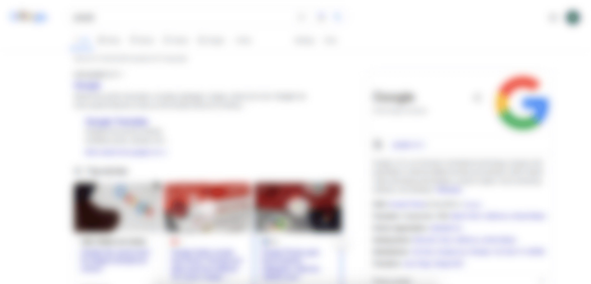

## Accessibility testing utils

1. Blur the site to test tab navigation and accessibility role/label/state.
   

- Credits
  http://udacity.github.io/ud891/lesson3-semantics-built-in/03-experience-screen-reader/

### Usage

```
import {blurElementStyle} from "accessibility-testing-utils"

<any-dom-element style={blurElementStyle}>{children}</any-dom-element>
```
