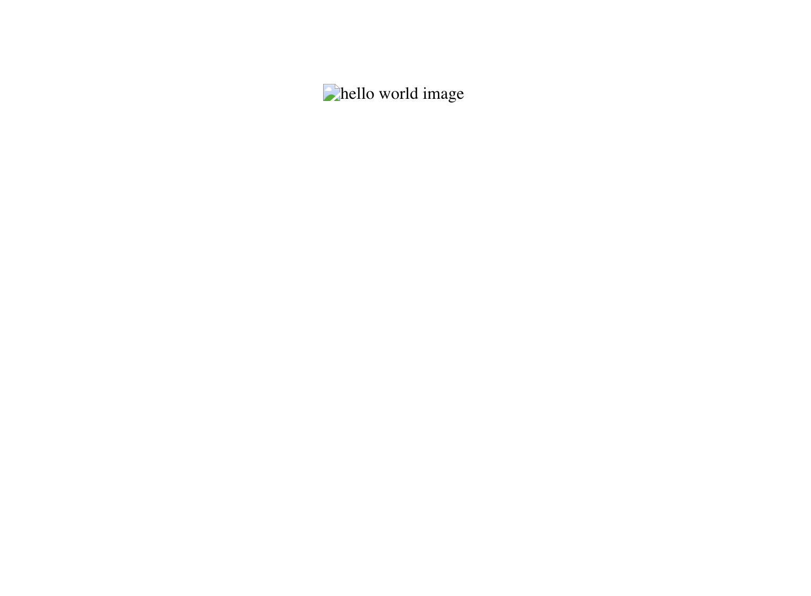

## Accessibility testing utils

### Installation
```
yarn add accessibility-testing-utils -D
OR
npm install accessibility-testing-utils  --save-dev
```

### 1. Blur the site to test tab navigation and accessibility role/label/state.


   

- This will disable pointer events, forcing you to use tabs so you can test the labels, state, values etc with a VoiceOver just like a real person.
- Credits
  http://udacity.github.io/ud891/lesson3-semantics-built-in/03-experience-screen-reader/


#### Usage

```
import {blurElementStyle} from "accessibility-testing-utils"

<div style={blurElementStyle}>{children}</div>
```


### 2. Testing alt attribute in images. 

   

- This will make `src` of all the images an invalid string.
- Even though tools like Lighthouse makes sure image has a valid alt attribute, but it's better to test it manually.
- [Watch this](https://www.youtube.com/watch?v=XCa6U1BllCY) to know why this is important.

### Usage

```
import { testImageAltAttribute } from 'accessibility-testing-utils';

 React.useEffect(()=>{
    testImageAltAttribute()
  },[])
```
